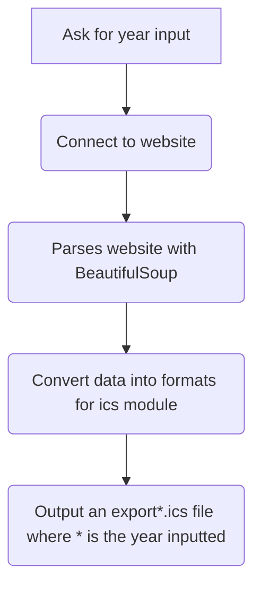

# holidayscalendar-scraper

This aims to scrape the below site(s) for the international holiday dates and name to output it into an .ics file.

https://www.holidayscalendar.com/categories/international/ (outputs export*.ics file) 
https://www.timeanddate.com/holidays/fun/ (outputs funexport*.ics file) 
where * is the year.

## Requirements
- Python3 [Link to install](https://wiki.python.org/moin/BeginnersGuide/Download)
- BeautifulSoup4 [Link to install](https://www.crummy.com/software/BeautifulSoup/bs4/doc/#installing-beautiful-soup)
- ics [Link to install](https://icspy.readthedocs.io/en/stable/)

## How to use
1. Run holi.py via python.
2. When prompted enter a valid year to be parsed.
3. export*.ics and funexport*.ics files should be exported in the folder where * is the year input.

Otherwise, the current .ics files can be downloaded and imported. (export2023.ics,funexport2023.ics)

### Psuedoflowchart below:

## Troubleshooting/Issues
- Not working for Windows devices. 
- 2020 year has an inconsistency in their html source for parsing which returns a type error.
- TBA

